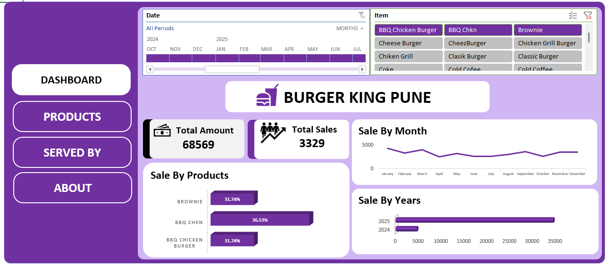
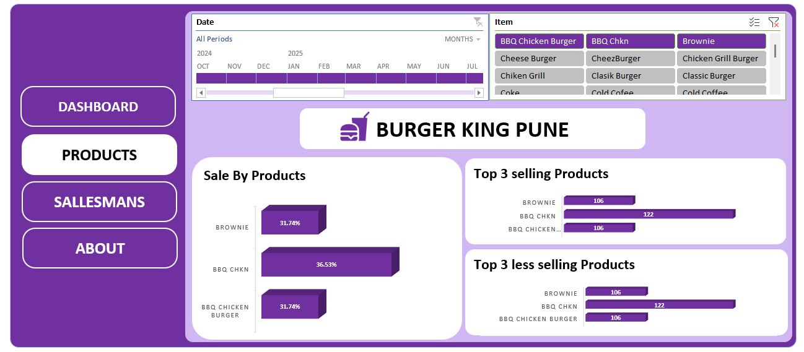
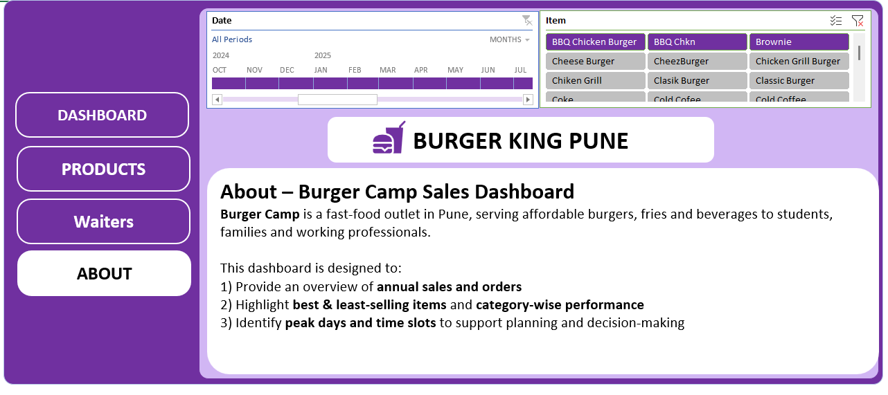

# 🍔 Burger King Pune – Sales Analysis Dashboard (Excel)

---

# 📌 Project Overview

---

This project is an interactive Excel dashboard created to analyze restaurant sales performance, product demand, and service insights.
It helps understand how sales, menu items, and staff activity impact overall business performance using simple and effective visual analysis.

---

# 🎯 Purpose of the Dashboard

---

1. The goal of this dashboard is to:

2. Track Total Sales and Revenue

3. Identify Top-Selling Products

4. Analyze Monthly and Yearly Sales Trends

5. Understand Order Distribution

6. Monitor Service Performance (Served By / Staff Insights)

This allows better decision-making for menu planning, sales strategy, and operations improvement.

---

# 🛠️ Tools Used

---

This dashboard was built using only:

1. 📊 Microsoft Excel

2. Pivot Tables

3. Pivot Charts

4. Slicers & Filters

5. Data Cleaning & Structuring

6. Interactive Dashboard Design

---

# 📂 Data Source

---

The dataset is structured restaurant sales data containing:

1. Order Details

2. Product Names

3. Sales Amount

4. Date & Year Information

5. Staff / Service Data

The data was cleaned and transformed directly inside Excel before visualization.

---

# 📊 Dashboard Modules

---

***1️⃣ Sales Dashboard***

---

Provides a complete overview of:

1. Total Amount & Total Sales

2. Monthly Sales Trend

3. Year-wise Comparison

4. Product-wise Contribution

Helps quickly understand business growth and revenue flow.

---

***2️⃣ Products Analysis***

---

Focuses on:

1. Best-Selling Items

2. Product Revenue Share

3. Category-Level Demand

4. Useful for deciding:

5. Which items to promote

Which items generate maximum profit

---

***3️⃣ Served By (Staff Insights)**

---

Analyzes:

1. Sales handled by staff

2. Contribution of service personnel

3. Operational performance visibility

Helps evaluate service efficiency.

---

***4️⃣ About / Summary View***

---

A clean presentation page explaining:

1. Business Snapshot

2. Dashboard Navigation

3. Key Metrics Overview

---

***📈 Key Insights You Can Derive***

---

✔ Identify high-performing menu items

✔ Track sales performance over time

✔ Understand customer demand patterns

✔ Improve pricing and promotion strategy

✔ Support operational and staffing decisions

---

# 🖼️ Dashboard Preview

---

***Sales Dashboard**

---

---

***Products Analysis***

---

---

***Served By Analysis***

---

---

***Summary / About**

---

